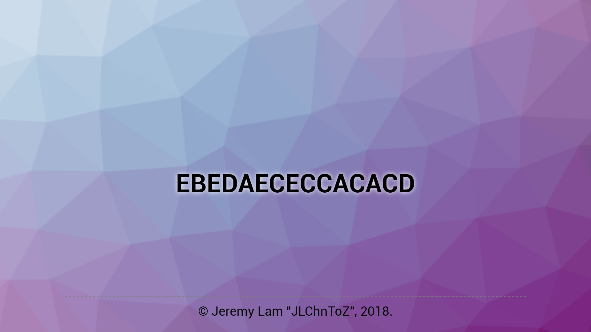
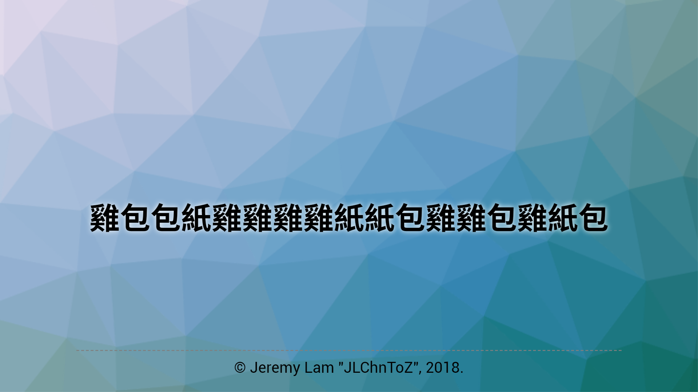
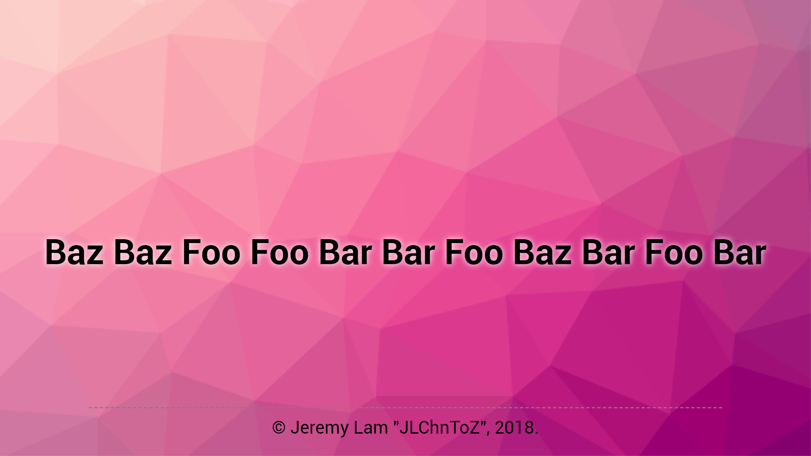
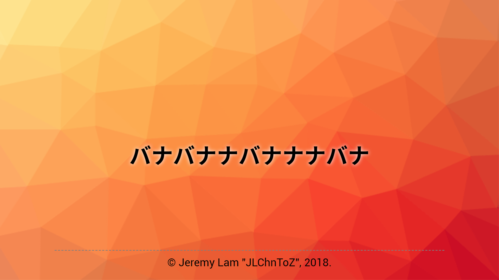

Mangsan Maker
=============
This is a toy that generates random words pattern by given the source.

Usage
-----
This is just a single HTML file with some scripting, just simply add your words after the link with a question mark (`?`) and enjoy!
It supports randomize "single characters" and "words", in default,
it will randomizes by the given letters and generates output,
but you can use the `&` to separates all of your words after the question mark of the link,
it will switch into the words randomization mode.

If you still don't have an idea on how to do it, you may have a look one of the demostration below.

If you click on the generated words on the page, it will re-generate a new one for you.

To share the result and let your friends to play with it,
simply copy the whole link with the hashes (the random id after the `#`) which automatically added.
If you just want to share the pattern you have entered but without the generated result,
do not copy the hashes while sharing, everything will be fine.

Snapshots / Demos
-----------------
- With some random Latin letters (ABCDE)
  
- With some random Chinese characters (紙包雞)
  
- With some random English words (Foo, Bar, Baz)
  
- With some random Japanese characters (バナナ)
  

License
-------
[DBAD License](LICENSE.md)
